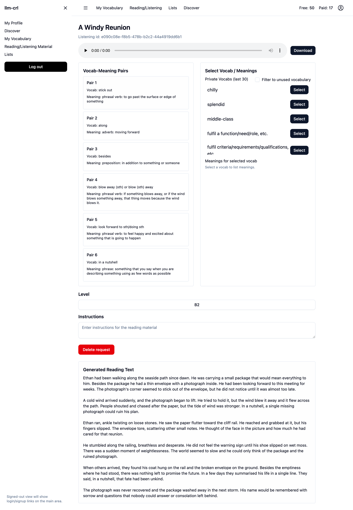
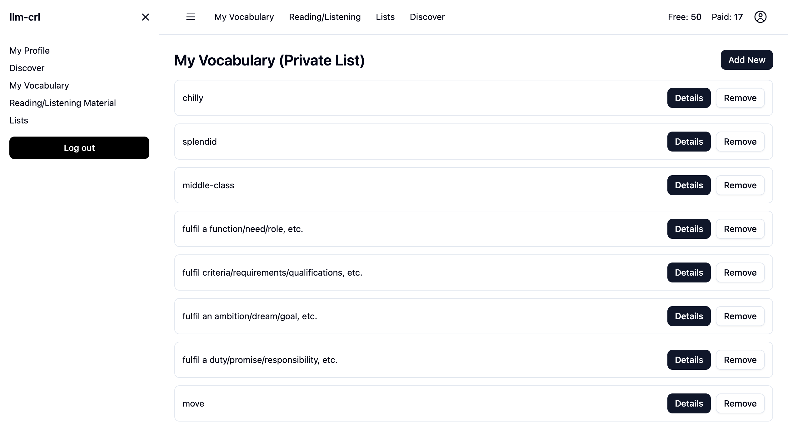
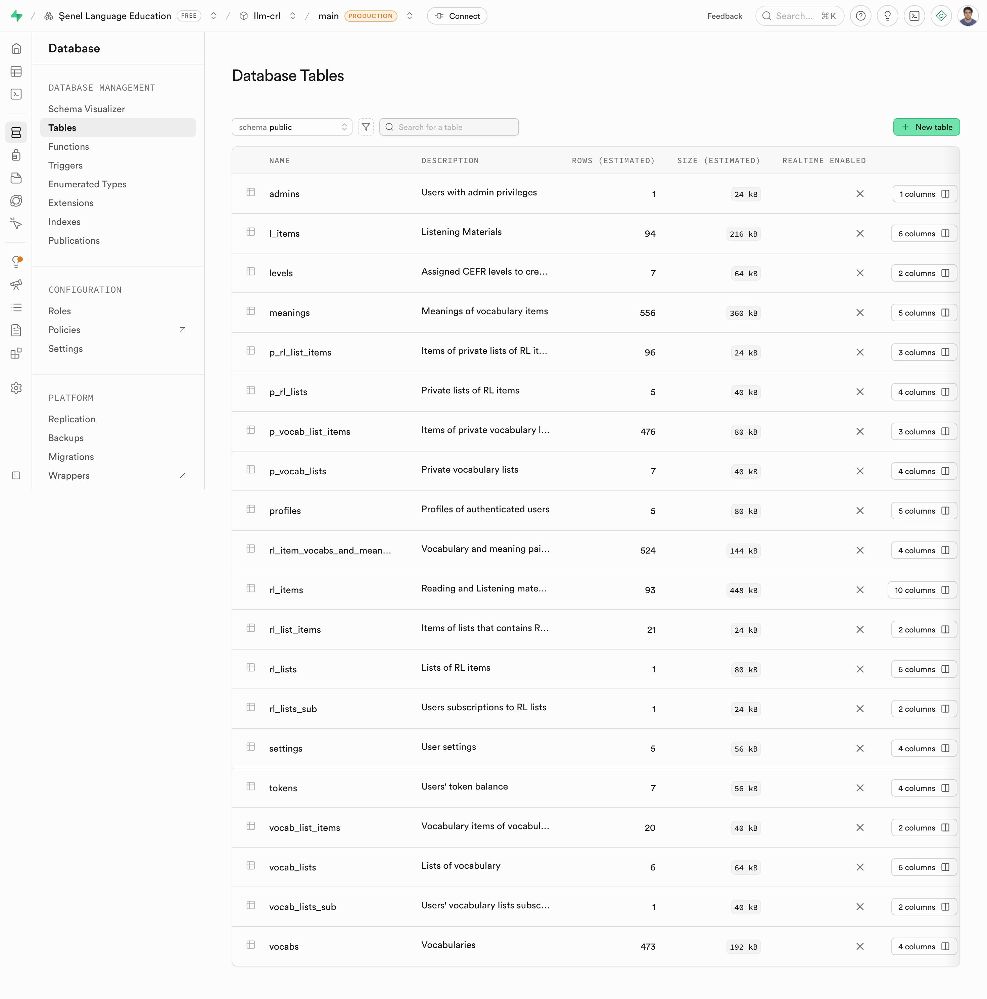
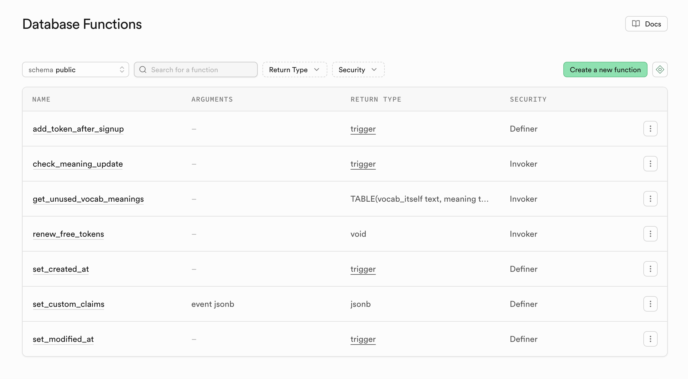

# LLM Reading Listening Content

Turn your chosen vocabulary into engaging Reading and Listening material.
Click to go to the [Web app](https://llm-crl.netlify.app/).

### Used Tech
- React.js with TypeScript
- shadcn-ui
- Supabase
  - Authentication
  - PostgreSQL
    - Authorization with RLS policies and Column-level security policies.
    - 20 Tables
    - Procedures
  - Edge Functions
  - Cron jobs
  - Google OAuth
- AWS
  - Lambda Functions
  - S3 Bucket Storage
- Frontend codebase built by RooCode using GPT-5 mini

## Screenshots

### Create Reading/Listening Material Page

### Personal Vacabulary Page

### Supabase

#### PostgreSQL DB Tables

#### PostgreSQL DB Procedures

